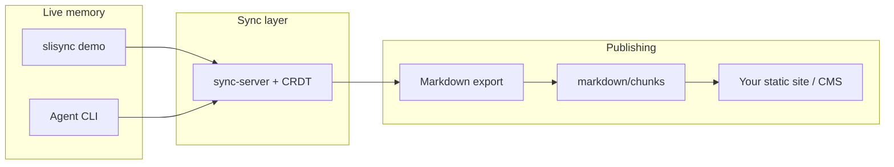

# Ecosystem map

Projects for the Slisync story: **write memory together → export Markdown → publish with your own tools**.

## Diagram

Slisync stops at **exported files**. How you build a site is outside this project.

## Repositories

| Folder | Role | One line | First command |
|--------|------|----------|---------------|
| **[slisync](https://github.com/runsli/slisync)** | Reference app + demo | Shared memory in a **room** | `npm run dev` → :3000 |
| **slisync-docs** (this site) | Public docs | How to use Slisync | `npm run dev` → :5173 |

::: tip Clone folder
On GitHub the repo is **slisync** — clone it as `~/Documents/GitHub/slisync` to match npm scope `@slisync/*`.
:::

## Which doc should I read?

| I want to… | Go to |
|------------|-------|
| Try the demo in 5 minutes | [Install & open demo](./guide/getting-started.md) → [Write memory together](./guide/scoped-memory.md) |
| Export then publish | [Full story: memory → Markdown → site](./guide/story-pipeline.md) |
| Understand terms (room, snippets) | [Glossary](./glossary.md) |
| SDK / protocol version | [slisync `docs/en`](https://github.com/runsli/slisync/tree/main/docs/en) · [packages/README](https://github.com/runsli/slisync/blob/main/packages/README.md) |

Keep **user docs** here and **protocol details** in the slisync repo to avoid duplicate maintenance.

### In-repo engineering docs (slisync)

| Topic | English | 中文 |
|-------|---------|------|
| Vision | [VISION.md](https://github.com/runsli/slisync/blob/main/docs/en/VISION.md) | [VISION.md](https://github.com/runsli/slisync/blob/main/docs/zh/VISION.md) |
| Roadmap | [ROADMAP.md](https://github.com/runsli/slisync/blob/main/docs/en/ROADMAP.md) | [ROADMAP.md](https://github.com/runsli/slisync/blob/main/docs/zh/ROADMAP.md) |
| Scoped memory (engineering) | [demo-scoped-memory.md](https://github.com/runsli/slisync/blob/main/docs/en/demo-scoped-memory.md) | [demo-scoped-memory.md](https://github.com/runsli/slisync/blob/main/docs/zh/demo-scoped-memory.md) |
| Export contract | [export.md](https://github.com/runsli/slisync/blob/main/docs/en/export.md) | [export.md](https://github.com/runsli/slisync/blob/main/docs/zh/export.md) |
| Engineering phases | [packages/README.md](https://github.com/runsli/slisync/blob/main/packages/README.md) | [packages/README.zh-CN.md](https://github.com/runsli/slisync/blob/main/packages/README.zh-CN.md) |

## Ports

| Service | Default |
|---------|---------|
| Slisync demo (embedded sync) | 3000 |
| Standalone sync server | 3001 |
| This VitePress site | 5173 |

[Glossary](./glossary.md) · [中文](/zh/ecosystem)
