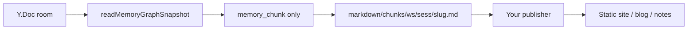

# Export Markdown

Export **`memory_chunk`** nodes in a room to **Markdown files** with YAML front matter. Slisync does not ship a blog engine — you point the output at any static site, CMS, or note tool you already use.

**v1 is a one-way snapshot** — no Markdown → CRDT write-back.

## Data flow



## Directory layout

```text
markdown/chunks/
  {workspaceId}/
    {sessionId}/          # _unsessioned when no session
      {slug}.md
```

`slug` is derived from `title`; titles with no Latin letters fall back to a `nodeId` prefix.

## Markdown example

```yaml
---
title: "Product goal: Demo centers on Memory Graph"
date: "2026-05-22T12:00:00.000Z"
workspaceId: ws-demo
sessionId: sess-demo
nodeId: node_xxx
kind: memory_chunk
roomId: example-room
source: chat
importance: 0.9
tags: [scope:chunk]
---

Body content…
```

Extra front matter fields are safe for most generators; consumers that only need `title` and `date` can ignore the rest.

## Three export paths

| Path | Command | Data source |
|------|---------|-------------|
| **Live HTTP** | `npm run export:chunks:http` | Running sync (dev + seed first) |
| **Local file** | `npm run export:chunks` | `.sync-data/crdt-rooms.json` |
| **CI / fixture** | `npm run export:chunks:ci` | `fixtures/crdt-rooms.example.json` |

### Live loop (recommended demo)

```bash
npm run dev
npm run graph:seed
npm run export:chunks:http -- --room example-room --out ./markdown/chunks
```

Demo UI: **Export Markdown drafts (zip)** downloads via HTTP (`Accept: application/zip`).

### Filters

Environment variables or CLI flags:

- `SYNC_EXPORT_WORKSPACE` / `--workspace`
- `SYNC_EXPORT_SESSION` / `--session`
- `SYNC_EXPORT_MIN_IMPORTANCE` / `--min-importance`

## SDK

```ts
import {
  exportMemoryChunksFromSnapshot,
  exportMemoryChunksFromCrdtFile,
} from "@slisync/sync-sdk/graph";

const files = exportMemoryChunksFromSnapshot(snapshot, {
  roomId: "example-room",
  workspaceId: "ws-demo",
  minImportance: 0.5,
});
// files[].relativePath, files[].markdown
```

HTTP client: [HTTP export API](./export-http.md).

## Explicitly not exported

- `task` and other non-`memory_chunk` nodes  
- Edits that exist only in browser IndexedDB and were **not** synced to the server  

## Next

[HTTP export API](./export-http.md) · [Memory → Markdown → site](./story-pipeline.md)
