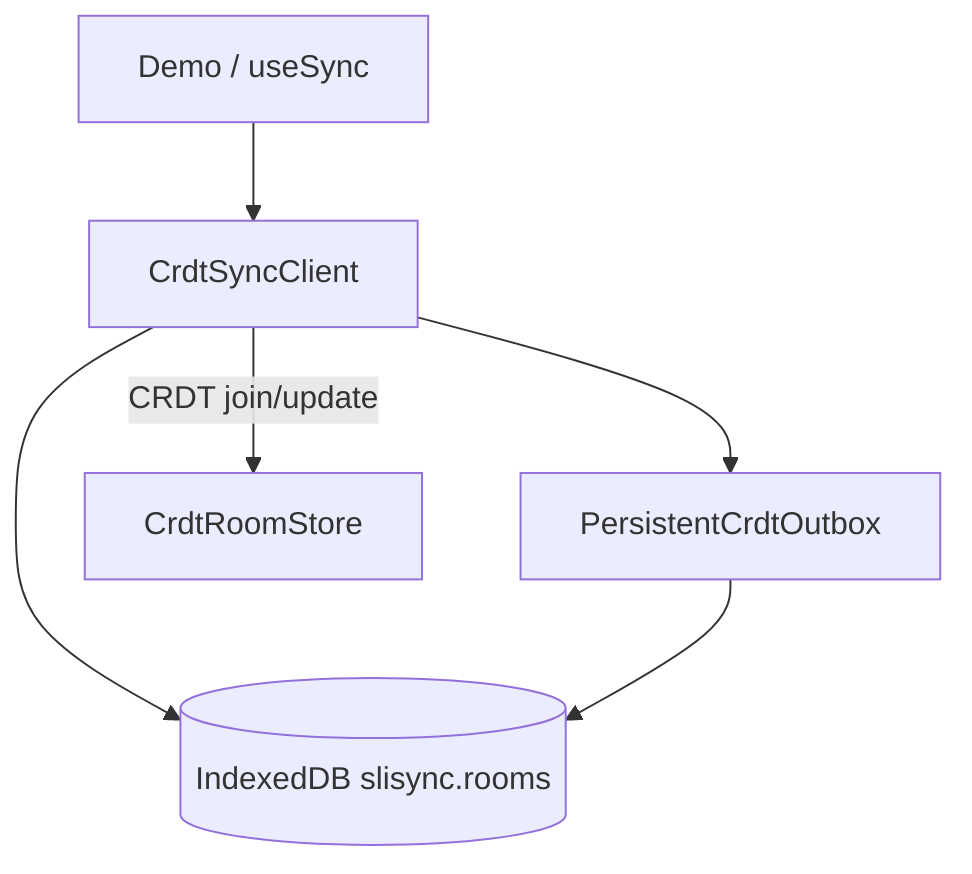

# Local-first

The browser persists each CRDT **room** in **IndexedDB**: after refresh or brief offline edits, the client restores the local `Y.Doc` and outbound queue, then merges with server CRDT when online. **The server remains merge authority.**

## Architecture



## `useSync` fields

```ts
const {
  patchData,
  outboxSize,
  localRestored,
  lastSyncedAt,
} = useSync({
  roomId: "example-room",
  defaultState: { message: "Hello", counter: 0 },
  strategy: "crdt",
  localPersistence: true, // default in browser; false in Node
});
```

| Field | Meaning |
|-------|---------|
| `localPersistence` | Use IndexedDB (or custom `LocalRoomStore`) |
| `localRestored` | `null` before hydrate; `true` if a local snapshot was applied |
| `lastSyncedAt` | Last successful server sync (Unix ms) |
| `outboxSize` | Pending upload queue length |

Clear local data: `clearLocalRoom(roomId)` (demo: “Clear local cache for this room”).

## `RoomLocalRecord` (IndexedDB)

| Field | Meaning |
|-------|---------|
| `docSnapshot` | base64 `Y.encodeStateAsUpdate(doc)` |
| `outbox` | FIFO pending increments (base64) |
| `clientId` | Stable client id across sessions |
| `lastSyncedAt` | Last sync timestamp |

Database **`slisync`**, object store **`rooms`**, key `roomId`.

## Demo check (Scoped memory step 6)

1. Edit a chunk  
2. DevTools → Network → **Offline**  
3. Edit again → **hard refresh**  
4. Content should still be there (from IndexedDB)  
5. Go online → merge with server  

## Export relationship

::: warning
HTTP / file **`export:chunks`** reads **server** CRDT persistence, **not** IndexedDB.  
Chunks edited only locally and not synced to the server **will not** appear in export. Ensure `syncReady` and server sync first.
:::

See [Export Markdown](./export.md).
