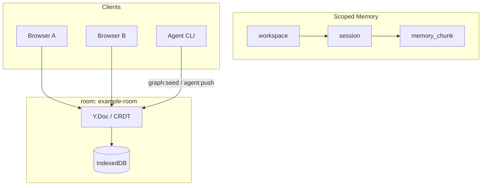

# Scoped memory demo

::: info You will
- [ ] Two browser windows show the same `memory_chunk` content
- [ ] ScopeBar shows online count ≥ 1
- [ ] After `npm run graph:seed`, you see an agent activity toast
:::

The demo **primary path**: edit layered memory `workspace → session → memory_chunk` in one **room**, with Presence, agents, and local-first.

See [Glossary](/glossary) for terms.

## Data flow



## Prerequisites

- [Install & run](./getting-started.md) with `npm run dev`
- Default room: `example-room`; scope: `ws-demo` / `sess-demo`

## 5-minute manual checklist

| Step | Action | Expected |
|------|--------|----------|
| 1 | Open demo, strategy **CRDT** | **Scoped Memory** tab; graph left, editor right |
| 2 | Wait for `connected` / `syncReady` | Empty room may auto-seed; or click init demo workspace |
| 3 | Edit a **memory_chunk** title or body | Instant local update; ScopeBar shows workspace / session |
| 4 | Second browser window, same URL | Same content within seconds; online count ~2 |
| 5 | Run `npm run graph:seed` or `agent:push` | Agent activity toast; graph/chunks may update |
| 6 | DevTools **Offline** → edit chunk → hard refresh → online | Edits remain ([Local-first](./local-first.md)) |
| 7 | Click **Export Markdown (HTTP)** | Download `{room}-chunks.zip` |

## CLI aligned with the demo

```bash
npm run graph:seed
npm run agent:push -- --action summarize --append " [from agent]"
```

`graph:seed` uses the same `buildScopedMemoryOps(agentId, "ws-demo", "sess-demo")` as the UI.

## Node kinds

| kind | Role |
|------|------|
| `workspace` | Project / workspace root |
| `session` | Session or topic under workspace |
| `memory_chunk` | Editable memory snippet (`title`, `content`, `importance`) |

`contains` edges express hierarchy; chunks may link via `related_to`.

## Task board relationship

- Same room, same CRDT; **Task board** tab shows `kind: task` nodes  
- Tasks are **not** included in Markdown export; track execution on the graph, prose in chunks  

See [Task bus](./task-bus.md).

## Troubleshooting

| Symptom | Fix |
|---------|-----|
| Page spins forever | Ensure `npm run dev` printed Listen; `node -v` is v20.x |
| No auto-seed | Session already seeded (`sessionStorage`); or init manually |
| Online count 0 | Need `connected` and at least one client in the room |
| `agent:push` fails | Start dev first; check `[agent:push]` in terminal and UI error bar |

More: [Troubleshooting](/reference/troubleshooting).
