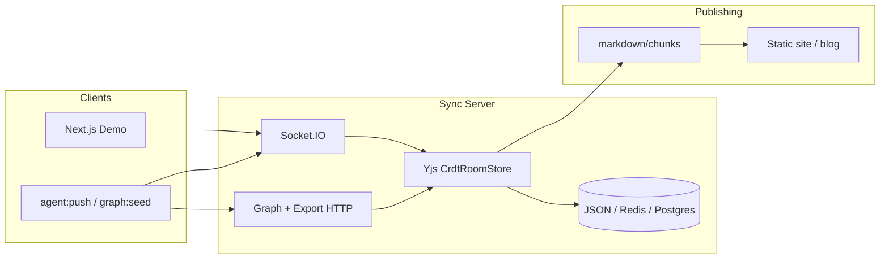

# Architecture

## End-to-end data flow



## Stack

| Layer | Tech | Notes |
|-------|------|-------|
| Demo UI | Next.js, TypeScript, Tailwind | `src/components/` |
| Client state | Zustand | `createSyncStore` |
| Transport | **Socket.IO** | Production path; WebRTC is future |
| Consistency | **Yjs / CRDT** | Primary; optional LWW + RFC 6902 |
| Server | Node.js | `server.ts` or standalone `:3001` |
| Server persistence | JSON file / **Redis** / **PostgreSQL** | CRDT store (pick one) |
| Browser persistence | **IndexedDB** | DB `slisync`, room snapshot + outbox |

## Inside a room

```text
Y.Doc (per room)
├── root / syncMeta          # shared fields (demo message/counter = legacy compare)
└── graph/
    ├── meta
    ├── nodes/               # workspace, session, memory_chunk, task, ...
    └── edges/               # contains, related_to, depends_on, ...
```

**Merge authority**: server Yjs is CRDT authority; agent/LWW bridges end in the same document.

## Deployment modes

| Mode | Command | Port |
|------|---------|------|
| Integrated demo | `npm run dev` | 3000 (UI + sync) |
| Standalone sync | `npm run sync:server` | 3001 (`NEXT_PUBLIC_SYNC_URL`) |
| Docs site | `slisync-docs` `npm run dev` | 5173 |

## Repo layout (reference impl)

```text
slisync/
├── src/ app/          # Next.js Demo
├── server.ts          # custom Node server mounting sync
├── packages/
│   ├── sync-schema/
│   ├── sync-sdk/
│   └── sync-server/
├── docs/en/ docs/zh/  # in-repo Markdown (may mirror this site)
├── scripts/           # graph:seed, export:chunks:http, agent:push, ...

Standalone docs repo: ~/Documents/GitHub/slisync-docs/ (this VitePress site)
```

[Roadmap](./roadmap.md) · [Scoped memory demo](../guide/scoped-memory.md)
