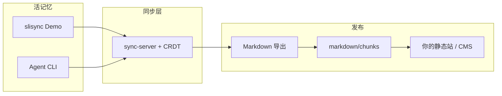

# 生态地图

Slisync 相关仓库与分工：**一起写记忆 → 导出 Markdown → 用你自己的工具发布**。

## 一张图

Slisync 的边界在 **导出文件**；如何建站不在本仓库范围内。

## 仓库对照

| 本地目录 | 产品角色 | 第一句话 | 第一条命令 |
|----------|----------|----------|------------|
| **[slisync](https://github.com/runsli/slisync)** | 参考实现 + Demo | 多人在同一 **room** 共忆 | `npm run dev` → :3000 |
| **slisync-docs**（本站） | 对外文档 | 产品说明与使用办法 | `npm run dev` → :5173 |

::: tip 克隆目录
GitHub 仓库名为 **slisync**，建议本地 clone 为 `~/Documents/GitHub/slisync`。
:::

## 我该看哪份文档？

| 你想… | 去看 |
|-------|------|
| 5 分钟打开 Demo | [安装并打开 Demo](./guide/getting-started.md) → [多人一起写记忆](./guide/scoped-memory.md) |
| 导出后发布 | [完整故事：共忆 → Markdown → 网站](./guide/story-pipeline.md) |
| 名词不懂 | [术语表](./glossary.md) |
| 接 SDK、查协议 | [slisync `docs/zh`](https://github.com/runsli/slisync/tree/main/docs/zh) · [packages/README.zh-CN](https://github.com/runsli/slisync/blob/main/packages/README.zh-CN.md) |

**用户文档**以本站为准；**协议与工程 Phase** 在 slisync 仓库维护，避免双份拷贝。

### slisync 仓库内工程文档

| 主题 | 中文 | English |
|------|------|---------|
| 愿景 | [VISION.md](https://github.com/runsli/slisync/blob/main/docs/zh/VISION.md) | [VISION.md](https://github.com/runsli/slisync/blob/main/docs/en/VISION.md) |
| 路线图 | [ROADMAP.md](https://github.com/runsli/slisync/blob/main/docs/zh/ROADMAP.md) | [ROADMAP.md](https://github.com/runsli/slisync/blob/main/docs/en/ROADMAP.md) |
| 分层记忆（工程版） | [demo-scoped-memory.md](https://github.com/runsli/slisync/blob/main/docs/zh/demo-scoped-memory.md) | [demo-scoped-memory.md](https://github.com/runsli/slisync/blob/main/docs/en/demo-scoped-memory.md) |
| 导出契约 | [export.md](https://github.com/runsli/slisync/blob/main/docs/zh/export.md) | [export.md](https://github.com/runsli/slisync/blob/main/docs/en/export.md) |
| 工程 Phase | [packages/README.zh-CN.md](https://github.com/runsli/slisync/blob/main/packages/README.zh-CN.md) | [packages/README.md](https://github.com/runsli/slisync/blob/main/packages/README.md) |

## 端口速查

| 服务 | 默认端口 |
|------|----------|
| Slisync Demo | 3000 |
| 独立 sync server | 3001 |
| 本 VitePress 文档站 | 5173 |

[术语表](./glossary.md) · [English](/ecosystem)
