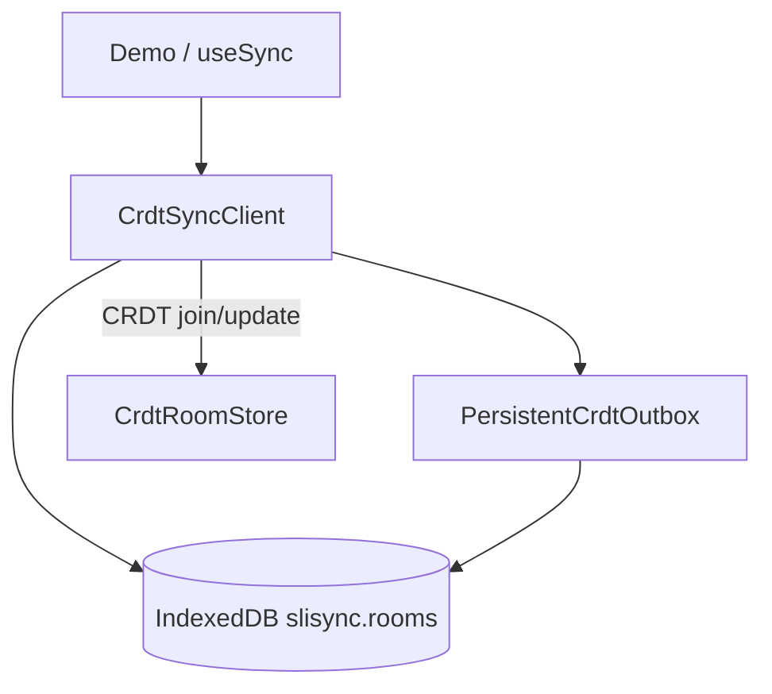

# Local-first 离线

浏览器端为 CRDT room 提供 **IndexedDB 持久化**：刷新页面或短暂离线编辑后，先从本地恢复 `Y.Doc` 与待发送队列，联网后再与服务端 CRDT 合并。**服务端仍为合并权威。**

## 架构



## useSync 相关字段

```ts
const {
  patchData,
  outboxSize,
  localRestored,
  lastSyncedAt,
} = useSync({
  roomId: "example-room",
  defaultState: { message: "Hello", counter: 0 },
  strategy: "crdt",
  localPersistence: true, // 浏览器默认 true；Node 可 false
});
```

| 字段 | 含义 |
|------|------|
| `localPersistence` | 是否使用 IndexedDB（可传自定义 `LocalRoomStore`） |
| `localRestored` | hydrate 前 `null`；曾应用本地快照为 `true` |
| `lastSyncedAt` | 上次与服务端成功同步（Unix ms） |
| `outboxSize` | 待上传队列长度 |

清除本地：`clearLocalRoom(roomId)`（Demo 提供「清除本 room 本地缓存」）。

## RoomLocalRecord（IndexedDB）

| 字段 | 说明 |
|------|------|
| `docSnapshot` | base64 的 `Y.encodeStateAsUpdate(doc)` |
| `outbox` | FIFO 待上传增量（base64） |
| `clientId` | 跨会话稳定客户端 id |
| `lastSyncedAt` | 上次同步时间 |

库名 **`slisync`**，object store **`rooms`**，主键 `roomId`。

## Demo 验收（Scoped Memory 步骤 6）

1. 改某个 chunk 内容  
2. DevTools → Network → **Offline**  
3. 再改 chunk → **硬刷新**  
4. 内容应仍在（来自 IndexedDB）  
5. 恢复网络 → 与服务端合并  

## 与导出的关系

::: warning
HTTP / 文件 **export:chunks** 读取的是 **服务端** CRDT 持久化，**不是** IndexedDB。  
仅本地编辑、未同步到 server 的 chunk **不会**出现在导出结果中。请先保证 `syncReady` 且已与 server 同步。
:::

见 [导出 Markdown](./export.md)。
