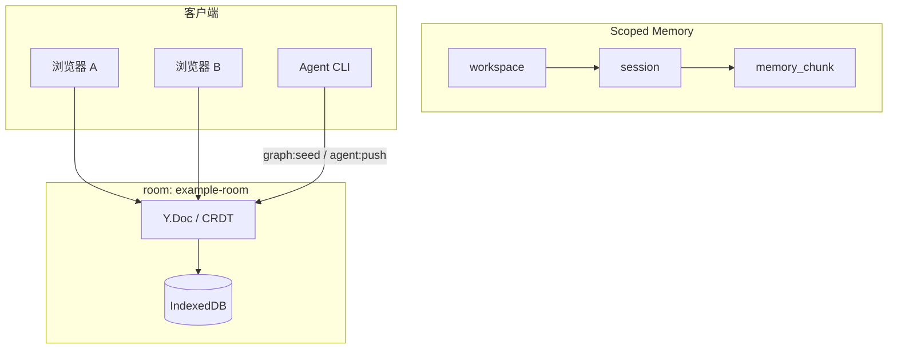

# 分层记忆演示（Scoped Memory）

::: info 本页你将完成
- [ ] 双窗口看到同一 `memory_chunk` 内容一致
- [ ] ScopeBar 显示在线人数 ≥ 1
- [ ] `npm run graph:seed` 后看到 Agent 活动提示
:::

Demo **主路径**：在同一 **room** 内编辑分层记忆 `workspace → session → memory_chunk`，配合 Presence、Agent 与 Local-first。

术语见 [术语表](../glossary.md)。

## 数据流



## 前置

- 已 [安装并运行](./getting-started.md) `npm run dev`
- 默认 room：`example-room`；scope：`ws-demo` / `sess-demo`

## 5 分钟手动验收

| 步骤 | 操作 | 期望 |
|------|------|------|
| 1 | 打开 Demo，策略选 **CRDT** | 首屏为「共享记忆 · Scoped Memory」；左图右文编辑 |
| 2 | 等待 `connected` / `syncReady` | 空 room 可自动 seed；或点「初始化演示工作区」 |
| 3 | 修改某 **memory_chunk** 标题或正文 | 本页即时更新；ScopeBar 显示 workspace / session |
| 4 | 再开一浏览器窗口，同 URL | 数秒内内容一致；在线人数约 2 |
| 5 | 终端执行 `npm run graph:seed` 或 `agent:push` | Agent 活动 toast；图/chunk 可能更新 |
| 6 | DevTools **Offline** 改 chunk → 刷新 → 恢复网络 | 本地编辑仍在（[Local-first](./local-first.md)） |
| 7 | 点 **「导出 Markdown（HTTP）」** / zip 按钮 | 下载 `{room}-chunks.zip`（`Accept: application/zip`） |

> `message` / `counter` 在折叠的 **旧版共享字段** 中，不是主路径。

## CLI 与 Demo 对齐

```bash
npm run graph:seed
npm run agent:push -- --action summarize --append " [from agent]"
```

`graph:seed` 使用与 UI 相同的 `buildScopedMemoryOps(agentId, "ws-demo", "sess-demo")`。Demo 页脚可复制 `agent:push` 命令。

导出读 **服务端 CRDT**（非 IndexedDB）：面板 zip 或 `npm run export:chunks:http`。见 [导出 Markdown](./export.md)。

## Demo 界面阶段

| 阶段 | 行为 |
|------|------|
| 0 | 以 Memory Graph 为主；旧字段折叠；LWW 在「高级」 |
| 1 | Scope 选择器 + 左右分栏 |
| 2 | 一次性自动 seed；可关闭欢迎条 |
| 3 | ScopeBar Presence；活动 toast；面板内 Agent 高亮 |

## 节点含义

| kind | 作用 |
|------|------|
| `workspace` | 项目/工作区根 |
| `session` | 会话或主题 |
| `memory_chunk` | 可编辑记忆片段（`title` + `content` + `importance`） |

边 `contains` 表达层级；chunk 之间可用 `related_to` 关联。

## 任务看板（同一 room）

**任务看板** Tab 与本文共用 `example-room`、`ws-demo` / `sess-demo`。任务为 `kind: "task"` 图节点，无独立表。

```bash
npm run task:seed
npm run agent:push -- --task-title "审查导出流水线" --status in_progress
```

验收清单：[任务看板](./task-bus.md)。记忆与任务 Tab 可同时使用；Agent 活动见顶部 toast 与面板提示。

## 故障排查

| 现象 | 处理 |
|------|------|
| 页面一直转圈 | 确认 `npm run dev` 已输出 `Listen on`；`npm run dev:stop` 后重启；`node -v` 为 v20.x |
| 无自动 seed | 同会话已 seed（`sessionStorage`）或 room 已有节点；点「初始化演示工作区」 |
| 在线人数为 0 | `connected` 后等待 Presence |
| agent:push 失败 | 先 `npm run dev`；看终端 `[agent:push]` 与连接错误条 |

更多：[故障排查](../reference/troubleshooting.md)
