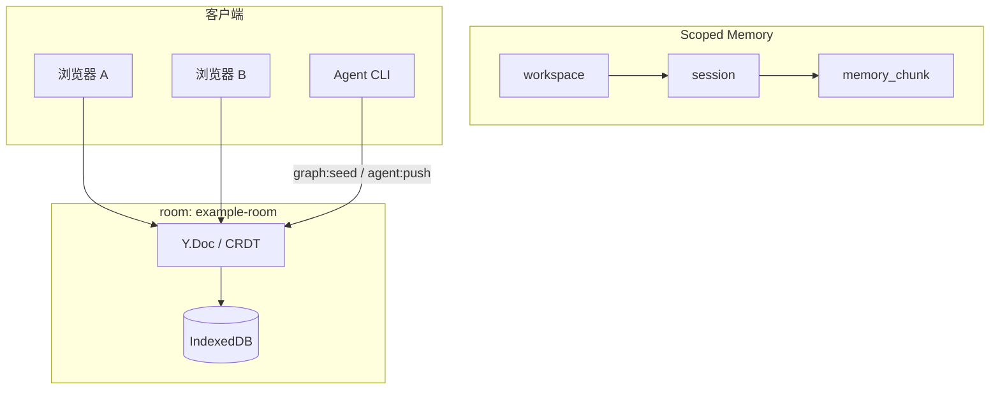

# 分层记忆演示（Scoped Memory）

::: info 本页你将完成
- [ ] 双窗口看到同一 `memory_chunk` 内容一致
- [ ] ScopeBar 显示在线人数 ≥ 1
- [ ] `npm run graph:seed` 后看到 Agent 活动提示
:::

Demo **主路径**：在同一 **room** 内编辑分层记忆 `workspace → session → memory_chunk`，配合 Presence、Agent 与 Local-first。

术语见 [术语表](../glossary.md)。

## 数据流



## 前置

- 已 [安装并运行](./getting-started.md) `npm run dev`
- 默认 room：`example-room`；scope：`ws-demo` / `sess-demo`

## 5 分钟手动验收

| 步骤 | 操作 | 期望 |
|------|------|------|
| 1 | 打开 Demo，策略选 **CRDT** | 首屏为「共享记忆 · Scoped Memory」；左图右文编辑 |
| 2 | 等待 `connected` / `syncReady` | 空 room 可自动 seed；或点「初始化演示工作区」 |
| 3 | 修改某 **memory_chunk** 标题或正文 | 本页即时更新；ScopeBar 显示 workspace / session |
| 4 | 再开一浏览器窗口，同 URL | 数秒内内容一致；在线人数约 2 |
| 5 | 终端执行 `npm run graph:seed` 或 `agent:push` | Agent 活动 toast；图/chunk 可能更新 |
| 6 | DevTools **Offline** 改 chunk → 刷新 → 恢复网络 | 本地编辑仍在（[Local-first](./local-first.md)） |
| 7 | 点 **「导出 Markdown（HTTP）」** | 下载 `{room}-chunks.zip` |

## CLI 与 Demo 对齐

```bash
npm run graph:seed
npm run agent:push -- --action summarize --append " [from agent]"
```

`graph:seed` 使用与 UI 相同的 `buildScopedMemoryOps(agentId, "ws-demo", "sess-demo")`。

## 节点含义

| kind | 作用 |
|------|------|
| `workspace` | 项目/工作区根 |
| `session` | 会话或主题 |
| `memory_chunk` | 可编辑记忆片段（`title` + `content` + `importance`） |

边 `contains` 表达层级；chunk 之间可用 `related_to` 关联。

## 与任务看板的关系

- 同一 room、同一 CRDT；**任务看板** Tab 展示 `kind: task` 节点  
- 任务**不会**进入 Markdown 导出；执行状态在 Graph，正文可写在 chunk  

见 [任务看板](./task-bus.md)。

## 故障排查

| 现象 | 处理 |
|------|------|
| 页面一直转圈 | 确认 `npm run dev` 已 Listen；`node -v` 为 v20.x |
| 无自动 seed | 同会话已 seed（`sessionStorage`）；或手动初始化 |
| 在线人数为 0 | 需 `connected` 且至少一客户端在 room |
| agent:push 失败 | 先启动 dev；看终端 `[agent:push]` 与页面错误条 |

更多：[故障排查](../reference/troubleshooting.md)
