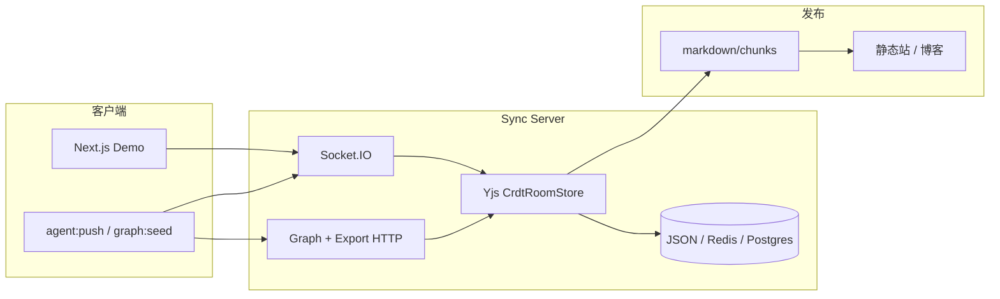

# 架构与技术栈

## 端到端数据流



## 技术栈

| 层级 | 技术 | 说明 |
|------|------|------|
| Demo UI | Next.js、TypeScript、Tailwind | `src/components/` |
| 客户端状态 | Zustand | `createSyncStore` |
| 传输 | **Socket.IO** | 生产路径；WebRTC 为远期选项 |
| 一致性 | **Yjs / CRDT** | 主路径；可选 LWW + RFC 6902 |
| 服务端 | Node.js | `server.ts` 或独立 `:3001` |
| 持久化 | JSON 文件 / **Redis** / **PostgreSQL** | CRDT 三选一，见环境变量 |
| 浏览器持久化 | **IndexedDB** | 库名 `slisync`，room 快照 + outbox |

## Room 内结构

```text
Y.Doc (per room)
├── root / syncMeta          # 共享字段（Demo 中 message/counter 为遗留对比）
└── graph/
    ├── meta
    ├── nodes/               # workspace, session, memory_chunk, task, ...
    └── edges/               # contains, related_to, depends_on, ...
```

**权威合并**：服务端 Yjs 为 CRDT 权威；Agent/LWW 桥接写入最终进入同一文档。

## 部署形态

| 形态 | 命令 | 端口 |
|------|------|------|
| 集成 Demo | `npm run dev` | 3000（UI + Sync） |
| 独立 Sync | `npm run sync:server` | 3001（需 `NEXT_PUBLIC_SYNC_URL`） |
| 文档站 | `slisync-docs` 仓库 `npm run dev` | 5173 |

## 仓库目录（参考实现）

```text
slisync/
├── src/ app/          # Next.js Demo
├── server.ts          # 自定义 Node 服务挂载 sync
├── packages/
│   ├── sync-schema/
│   ├── sync-sdk/
│   └── sync-server/
├── docs/en/ docs/zh/  # 仓库内 Markdown（可与本站同步维护）
├── scripts/           # graph:seed, export:chunks:http, agent:push, ...

独立官网仓库：`~/Documents/GitHub/slisync-docs/`（本 VitePress）
```

下一步：[路线图](./roadmap.md) · [Scoped Memory 演示](../guide/scoped-memory.md)
